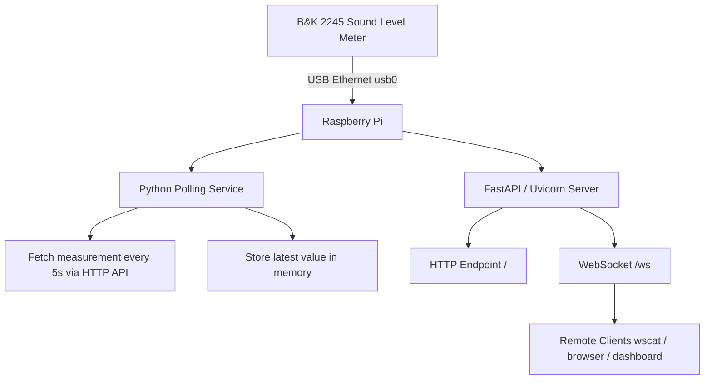

# B&K 2245 Raspberry Pi Logger & WebSocket Gateway


This project collects measurement data from a Brüel & Kjær 2245 sound level meter via its HTTP (WebXi) API using a Raspberry Pi.  
Exposes it in real time using a WebSocket server.

---

## Features

- Auto-detects B&K device over USB Ethernet
- Reads measurement via HTTP API
- Real-time WebSocket streaming
- Works with systemd service (auto-start on boot)

---

## System Architecture



---


## Requirements

- Raspberry Pi (tested on Pi 2B)
- Python 3
- Internet / local network access to B&K 2245 (remember we work with **USB CDC ECM/RNDIS** virtual network interface)(Ethernet over USB)

## Installation

```bash
git clone https://github.com/carnestoltes/bk2245-logger.git
cd bk2245-logger
```
```bash
sudo cp systemd/bk2245.service /etc/systemd/system/
sudo systemctl daemon-reload
sudo systemctl enable bk2245.service
sudo systemctl start bk2245.service
```

You should have an environment for operate with Python, so let's create it

```bash
cd ~
python3 -m venv .venv
source .venv/bin/activate
```
Install dependencies:

```bash
pip3 install fastapi uvicorn requests
pip3 install -r requirements.txt
```

## Debug

```bash
journalctl -u bk2245.service -f
```

## Run Locally

```bash
uvicorn src.bk2245_logger:app --host 0.0.0.0 --port 8000
```

## WebSocket Test

This features need node.js so if your Raspberry has a limited storage try to avoid it

```bash
npm install -g wscat
wscat -c ws://IP_sonometer/ws
```