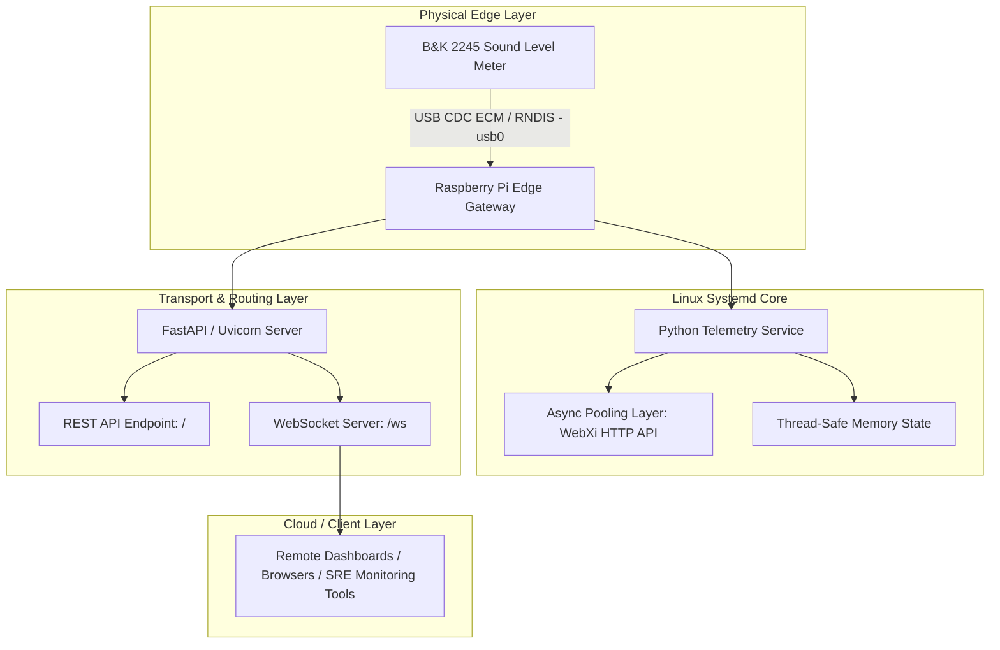

# Edge IoT Gateway: B&K 2245 Raspberry Pi Logger & WebSocket Streamer


An enterprise-grade Edge Computing Gateway designed for industrial telemetry. This repository automates the data acquisition from a **Brüel & Kjær 2245 Sound Level Meter** via its WebXi HTTP API using a Linux-based Raspberry Pi, exposing the telemetry data in real-time through a high-performance **Async WebSocket Gateway**.

---

## Key Architectural Features

- **Virtual Network Interface (USB CDC ECM/RNDIS):** Automates communication over an Ethernet-over-USB interface (`usb0`), managing localized networking between the sensor and the edge gateway.
- **Asynchronous Data Pipeline:** Built on top of `FastAPI` and `HTTPX/Requests` to handle non-blocking asynchronous pooling and broadcasting.
- **Self-Healing & Reliability:** Fully integrated with **Linux Systemd** providing auto-start on boot, automated crash recovery, and logging rotation.
- **Real-Time Telemetry Streaming:** Implements WebSocket protocol (`/ws`) for low-latency concurrent data broadcasting to multiple remote clients/dashboards.

---

## System Architecture


```mermaid
flowchart TD
    subgraph Physical Edge Layer
        A[B&K 2245 Sound Level Meter] -->|USB CDC ECM / RNDIS - usb0| B[Raspberry Pi Edge Gateway]
    end

    subgraph Linux Systemd Core
        B --> C[Python Telemetry Service]
        C --> D[Async Pooling Layer: WebXi HTTP API]
        C --> E[Thread-Safe Memory State]
    end

    subgraph Transport & Routing Layer
        B --> F[FastAPI / Uvicorn Server]
        F --> G[REST API Endpoint: /]
        F --> H[WebSocket Server: /ws]
    end

    subgraph Cloud / Client Layer
        H --> I[Remote Dashboards / Browsers / SRE Monitoring Tools]
    end
```
---

# Production Deployment & Automation

To ensure a deterministic installation and high availability, the setup process has been streamlined into system automation commands.

## 1. Environment & Dependencies Setup

Isolate the python environment and install production dependencies using asynchronous HTTP clients:

### Navigate to home directory, create and activate virtual environment

```bash
cd ~
python3 -m venv .venv
source .venv/bin/activate
```

### Clone & Install requirements

```bash
git clone https://github.com/carnestoltes/bk2245-logger.git
cd bk2245-logger
pip3 install --upgrade pip
pip3 install -r requirements.txt
```

### 2. Systemd Service Daemonization (Self-Healing Configuration)

Deploy the service to the Linux system init daemon to ensure reliability:

```bash
sudo systemctl daemon-reload
sudo systemctl enable bk2245.service
sudo systemctl start bk2245.service
```

# Operations & Troubleshooting (SRE Workflow)

### Real-Time Log Inspection

Monitor the health, internal connection metrics, and runtime behavior of the Edge service via journalctl:

```bash
journalctl -u bk2245.service -f -n 50
```

### Manual Development Runtime

For debugging or local development testing without daemonization, expose the ASGI server to the local network:

```bash
uvicorn src.bk2245_logger:app --host 0.0.0.0 --port 8000 --reload
```
# Telemetry Verification (WebSocket Client)

To run network verification tests without heavy dependencies like Node.js inside limited storage edge hardware, you can connect from an external monitoring instance:

### From a remote operator workstation (Only if necessary beacuse has a big consumption of resources)

```bash
npm install -g wscat
wscat -c ws://<RASPBERRY_PI_IP>:8000/ws
```
